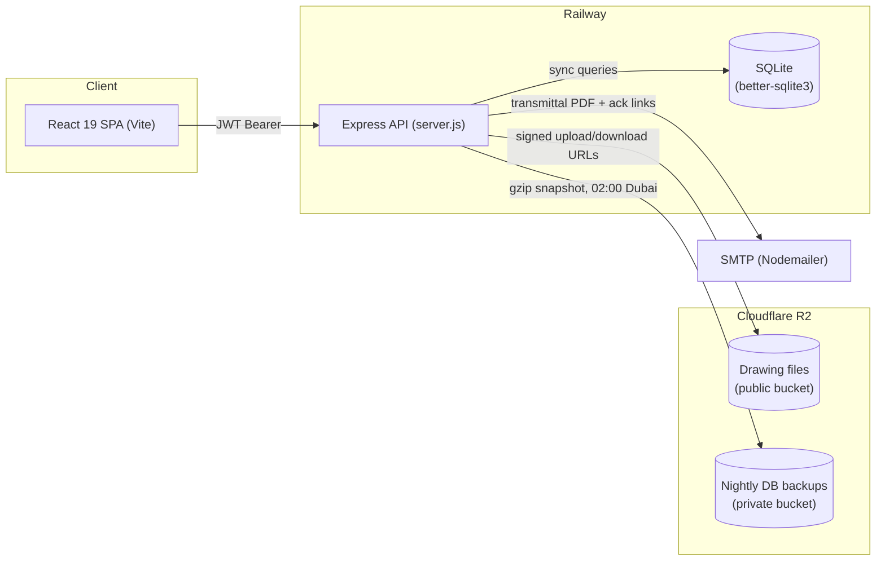

# DrawVault

A production document management system for construction drawings, built for **Unique
Properties** to replace ad-hoc file sharing with a single source of truth for drawing
registers, revision history, and transmittals across multiple projects.

**Live app:** [drawing-management-delta.vercel.app](https://drawing-management-delta.vercel.app)

## Key features

- **Role-based access control** — three roles (Director, In House Architect, Project Team)
  enforced on both the API (middleware per route) and the UI (route guards, hidden actions).
  Directors manage everything; In House Architects can upload/edit/revise files; Project Team
  is read-only.
- **Drawing register with full revision history** — every "Upload New Revision" snapshots the
  prior version instead of overwriting it; the UI shows a Current/Superseded badge trail per
  drawing.
- **Folder-tree document explorer** — per-project folder structure with drag-and-drop upload,
  move/rename/delete, and support for PDF, CAD (DWG/DXF/IFC/RVT/NWD), image, and Office file
  types up to 50 MB.
- **Transmittals with recipient acknowledgment tracking** — auto-numbered transmittals (`TRN-NNN`)
  email a PDF cover sheet to recipients and track per-recipient read receipts via signed,
  single-use acknowledgment links (no login required on the recipient side).
- **Cloudflare R2 file storage** — uploads go straight to R2; downloads/views use short-lived
  signed URLs rather than exposing bucket credentials or permanent public links; files are
  deleted from R2 when their drawing record is deleted.
- **Automated, monitored database backups** — a nightly job snapshots the SQLite database,
  compresses it, and uploads it to a private R2 bucket with 30-day retention, self-re-arming
  across restarts, with a Director-only health endpoint and a documented restore runbook.
- **Dashboard & analytics** — KPI cards, activity feed, and discipline-breakdown charts with
  CSV export (Director only).
- **JWT auth with server-side revocation** — stateless tokens backed by a per-user
  `token_version`, so a password reset or deactivation invalidates existing sessions immediately.

## Architecture



The frontend is a single-page React app that authenticates via JWT and drives all state from
`App.jsx` (projects → drawings/transmittals fetched per active project, always re-fetched after
a mutation — no optimistic updates). The backend is a single Express app (`server.js`) fronting
SQLite, with Cloudflare R2 for file storage and Nodemailer for transactional email. Both deploy
independently and automatically: frontend to Vercel, backend to Railway, on every push to `main`.

## Tech stack

| Layer | Technology |
|---|---|
| Frontend | React 19, Vite 8, Tailwind CSS 3, React Router 7, lucide-react |
| Backend | Node.js, Express 4, better-sqlite3, multer, bcrypt, jsonwebtoken, helmet, express-rate-limit |
| File storage | Cloudflare R2 (S3-compatible, via `@aws-sdk/client-s3`) |
| Email | Nodemailer (SMTP) |
| PDF generation | pdfkit |
| Testing | Jest + Supertest (backend), Vitest + React Testing Library (frontend) |
| CI | GitHub Actions — lint + test on backend, test + build on frontend |
| Hosting | Vercel (frontend), Railway (backend + persistent volume for SQLite) |

Plain JavaScript throughout — no TypeScript.

## Setup

Requires Node.js 20+.

```bash
# Backend
cd dms-backend
npm install
cp .env.example .env   # fill in JWT_SECRET, R2 credentials, etc.
npm run dev             # http://localhost:3000

# Frontend (separate terminal)
cd dms-frontend
npm install
npm run dev             # http://localhost:5174
```

The backend fails fast if R2 credentials are missing rather than silently disabling uploads —
see `dms-backend/.env.example` for the full list of required/optional variables, and
[`docs/ARCHITECTURE.md`](docs/ARCHITECTURE.md) for the complete environment variable reference.

### Tests & lint

```bash
cd dms-backend  && npm test && npm run lint   # 61 tests (Jest)
cd dms-frontend && npm test && npm run lint   # 12 tests (Vitest)
```

Both suites currently pass, and `npm run build` (frontend) produces a working production
bundle. CI (`.github/workflows/ci.yml`) runs both on every push/PR to `main`.

## Documentation

- [`docs/ARCHITECTURE.md`](docs/ARCHITECTURE.md) — full API endpoint reference, DB schema,
  middleware, environment variables, and feature-by-feature frontend architecture
- [`docs/RESTORE.md`](docs/RESTORE.md) — database backup restore runbook
- [`CLAUDE.md`](CLAUDE.md) — repo conventions and branch discipline for AI-assisted development

---

*A native mobile shell (Capacitor, iOS/Android) is under active development on a separate
branch and is not part of the `main` deployment described above.*
